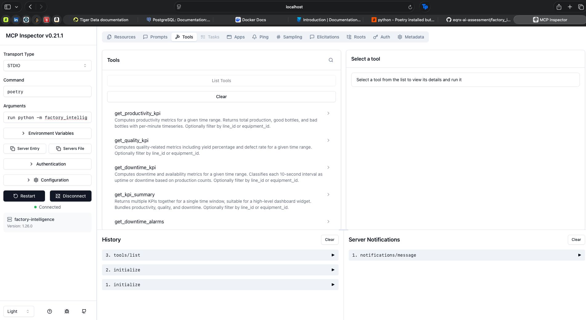

# Factory Intelligence

This project has MCP server that exposes 5 KPI tools for a factory production line. An LLM agent calls these tools via MCP to answer questions like "Show me productivity KPI for last week". 

**Data flow**
```
Factory sensors -> TimescaleDB (stores data) -> MCP tools (computes KPIs) -> LLM agent (interprets) -> User's dashboard (displays)
```

**Project structure**
```
├── tests
  ├── test_tools.py          <- Test for all 5 tools
  └── test_tools_output.log  <- Output from running tests
├── src/factory_intelligence/
  ├── mcp_server.py          <- MCP server entry point
  ├── config.py              <- DB connection settings
  ├── tools/
  │   ├── productivity.py    <- Tool 1: Production counts
  │   ├── quality.py         <- Tool 2: Yield % & defect rate
  │   ├── downtime.py        <- Tool 3: Availability %
  │   ├── summary.py         <- Tool 4: All KPIs bundled
  │   └── alarms.py          <- Tool 5: Alarms during downtime
  ├── utilities/
  │   ├── db.py              <- Async connection pool
  │   ├── validation.py      <- Input validation
  │   └── response.py        <- Standardized JSON responses
  └── database/
      ├── setup_timescaledb.sh
      ├── connect_db.sh
      └── verify.sql
```

## Setup
### 1. Environment
```bash
# Install poetry
$ curl -sSL https://install.python-poetry.org | python3 -
$ export PATH="$HOME/.local/bin:$PATH"
$ poetry --version
```

```bash
# Install dependencies
$ poetry install
```
### 2. Docker
Install docker desktop from docker.com
```bash
# Verify using below
docker --version
$ docker run hello-world
```

### 3. Database
Download [dump file](https://drive.google.com/file/d/1S1MoJjClcI0RewEP9wwQmXD4dGsWlrEt/view?usp=sharing) and place it in the below location and update the path of `DUMP_FILE` in `setup_timescaledb.sh`:

Path: `src/factory_intelligence/database/ProductionDB_aggregates_20251214.dump`
```bash
# Setup TimescaleDB
cd src/factory_intelligence/database
chmod +x setup_timescaledb.sh
./setup_timescaledb.sh
```
This pulls TimescaleDB, creates the database, restores the dump, and verifies row counts.

Data range: December 5–14, 2025 (9 days of production data).

## Run tests
Make sure Docker container is still running
```bash
# Be inside eqrx-ai-assessment/factory_intelligence level
# ls gives you pyproject.toml, poetry.lock, README.md, src, tests
$ poetry run python tests/test_tools.py
```

## Run MCP server locally
```bash
$ poetry run python -m factory_intelligence.mcp_server
```

## Tools
 
| Tool | Description | Data Source |
|------|-------------|------------|
| `get_productivity_kpi` | Total production, good/bad counts | `agg_counter_1min` |
| `get_quality_kpi` | Yield %, defect rate % | `agg_counter_1min` |
| `get_downtime_kpi` | Uptime/downtime, availability % | `agg_counter_10sec_delta` |
| `get_kpi_summary` | All KPIs bundled | Both tables above |
| `get_downtime_alarms` | Alarms active during downtime | `agg_counter_10sec_delta`, `agg_boolean_state_durations` |
 
### Input Schema (all tools)
| Parameter | Type | Required |
|-----------|------|----------|
| `start_time` | ISO 8601 string | Yes |
| `end_time` | ISO 8601 string | Yes |
| `line_id` | integer | No |
| `equipment_id` | integer | No |
 
### Example Tool Call
```json
{
  "start_time": "2025-12-10T00:00:00Z",
  "end_time": "2025-12-10T23:59:59Z"
}
```
 
### Example Output — Productivity
```json
{
  "tool": "get_productivity_kpi",
  "inputs": {
    "start_time": "2025-12-10T00:00:00Z",
    "end_time": "2025-12-10T23:59:59Z"
  },
  "result": {
    "summary": {
      "kpi_name": "Productivity",
      "total_production": 54074.0,
      "good_bottles": 53473.0,
      "bad_bottles": 601.0,
      "unit": "bottles"
    },
    "timeseries": [
      {"timestamp": "2025-12-10T00:00:00+00:00", "good": 0.0, "bad": 0.0, "total": 0.0},
      {"timestamp": "2025-12-10T00:01:00+00:00", "good": 0.0, "bad": 0.0, "total": 0.0},
      ...
    ],
    "metadata": {
      "data_source": "agg_counter_1min",
      "computation_note": "Total production = good + bad bottles"
    }
  },
  "status": "ok",
  "errors": []
}
```

### Example Output — Quality
```json
{
  "tool": "get_quality_kpi",
  "inputs": {
    "start_time": "2025-12-10T00:00:00Z",
    "end_time": "2025-12-10T23:59:59Z"
  },
  "result": {
    "summary": {
      "kpi_name": "Quality",
      "yield_pct": 98.89,
      "defect_rate_pct": 1.11,
      "good_bottles": 53473.0,
      "bad_bottles": 601.0,
      "total_production": 54074.0,
      "unit": "percent"
    },
    "timeseries": [
      {"timestamp": "2025-12-10T00:00:00+00:00", "yield_pct": 0.0, "good": 0.0, "bad": 0.0},
      ...
    ],
    "metadata": {
      "data_source": "agg_counter_1min",
      "computation_note": "Yield = (good / total) * 100"
    }
  },
  "status": "ok",
  "errors": []
}
```

### Example Output — Downtime
```json
{
  "tool": "get_downtime_kpi",
  "inputs": {
    "start_time": "2025-12-10T00:00:00Z",
    "end_time": "2025-12-10T23:59:59Z"
  },
  "result": {
    "summary": {
      "kpi_name": "Downtime",
      "availability_pct": 44.73,
      "downtime_seconds": 47750,
      "downtime_minutes": 795.83,
      "uptime_seconds": 38650,
      "uptime_minutes": 644.17,
      "downtime_intervals": 4775,
      "uptime_intervals": 3865,
      "unit": "percent"
    },
    "timeseries": [],
    "metadata": {
      "data_source": "agg_counter_10sec_delta",
      "computation_note": "Each 10sec interval with 0 production = downtime"
    }
  },
  "status": "ok",
  "errors": []
}
```

### Example Output — Downtime Alarms
```json
{
  "tool": "get_downtime_alarms",
  "inputs": {
    "start_time": "2025-12-10T00:00:00Z",
    "end_time": "2025-12-10T23:59:59Z"
  },
  "result": {
    "summary": {
      "kpi_name": "Downtime Alarms",
      "downtime_events": 164,
      "total_alarms_found": 259,
      "unique_alarms": 22,
      "top_alarms": [
        {"alarm_name": "HMI_ALARMS_1.0", "occurrences": 42, "total_duration_seconds": 15323.8, "total_duration_minutes": 255.4},
        {"alarm_name": "HMI_ALARMS_1.1", "occurrences": 26, "total_duration_seconds": 13917.64, "total_duration_minutes": 231.96},
        {"alarm_name": "HMI_ALARMS_1.2", "occurrences": 20, "total_duration_seconds": 13777.63, "total_duration_minutes": 229.63},
        ...
      ]
    },
    "timeseries": [
      {"start": "2025-12-10T00:00:00+00:00", "end": "2025-12-10T00:36:00+00:00", "duration_seconds": 2160},
      {"start": "2025-12-10T00:36:10+00:00", "end": "2025-12-10T00:37:30+00:00", "duration_seconds": 80},
      ...
    ],
    "metadata": {
      "data_source": "agg_counter_10sec_delta, agg_boolean_state_durations, tags_metadata",
      "computation_note": "Alarms active during periods where production = 0"
    }
  },
  "status": "ok",
  "errors": []
}
```

### Example Output — Error Case
```json
{
  "tool": "get_productivity_kpi",
  "inputs": {
    "start_time": "2020-01-01T00:00:00Z",
    "end_time": "2020-01-02T00:00:00Z"
  },
  "result": null,
  "status": "error",
  "errors": ["No data found for the given time range"]
}
```
 
## Engineering Notes

### Why Specific Tables Were Used

- **Tools 1 & 2 (Productivity, Quality):** Using `agg_counter_1min`, pre-aggregated 1-minute buckets are sufficient for production totals and yield calculations. Faster than scanning 10-second rows since we only need totals per time bucket.

- **Tool 3 (Downtime):** Using `agg_counter_10sec_delta`, 10-second granularity is required because downtime is defined as any interval where production = 0. Using 1-minute aggregates would mask short downtime periods (ex: a 1-min bucket could show total = 5 bottles but 4 of the 6 ten-second intervals inside had 0 production).

- **Tool 4 (Summary):** Calls Tools 1-3 internally, so it uses both `agg_counter_1min` and `agg_counter_10sec_delta`.

- **Tool 5 (Alarms):** Using `agg_counter_10sec_delta` for downtime detection, then joins with `agg_boolean_state_durations` for alarm states and `tags_metadata` to identify alarm tags (`is_alarm = true`).

### Assumptions

- `HMI_TOTAL_GOOD_BOTTLES` and `HMI_TOTAL_BAD_BOTTLES` are the sole production counters. Both are counter-type tags (delta values, not gauges).
- A 10-second interval with zero total production (good + bad = 0) is classified as downtime.
- No target production value is available in the schema, so productivity is reported as absolute counts rather than a ratio.
- All timestamps are stored and queried in UTC.
- `line_id` and `equipment_id` are optional filters, when omitted, queries return data across all lines/equipment.

### Performance Considerations

- Queries filter by `tag_name` and `bucket` range, both indexed by TimescaleDB's chunk-based partitioning.
- `agg_counter_1min` is used over `agg_counter_10sec_delta` for Tools 1 & 2 to reduce the number of rows scanned (6x fewer rows per time range).
- The async connection pool (`psycopg3 AsyncConnectionPool`, min=2, max=10) reuses connections across concurrent tool calls.
- For production use, query latency scales linearly with time range. Multi-user scenarios would require tuning pool size and potentially adding read replicas.
- Consecutive downtime grouping in Tool 5 uses SQL window functions (`ROW_NUMBER` gap detection) to group intervals server-side, avoiding fetching all individual rows into Python.
- The CASE WHEN pivot pattern combines two tags (good/bad) into a single row per bucket, halving the result set compared to separate queries.

## Screenshots

All screenshots below use the time range `2025-12-10T00:50:00Z` to `2025-12-10T00:53:00Z` (3-minute window). Tool 5 includes an additional screenshot with a wider time range to show a case where downtime alarms were actually triggered.

### MCP Server Running


MCP Inspector connected to the server via `poetry run python -m factory_intelligence.mcp_server`. All 5 tools are listed and ready.

### Tool 1: Productivity KPI
.png)
.png)

In this 3-minute window, the line produced **287 total bottles** (285 good, 2 bad). The timeseries shows per-minute counts: 88 in the first minute, 96 in the second, and 101 in the third. Production was active and increasing across all 3 minutes.

### Tool 2: Quality KPI
.png)
.png)

Yield is **99.30%** with a defect rate of **0.70%** (2 bad out of 287 total). The 2 defective bottles occurred in the first minute (yield 97.78%), while minutes 2 and 3 had 100% yield.

### Tool 3: Downtime KPI
.png)

**100% availability**. All 18 ten-second intervals had production (uptime_intervals: 18, downtime_intervals: 0). The line was running continuously for the entire 3-minute window (180 seconds uptime, 0 seconds downtime).

### Tool 4: KPI Summary
.png)
.png)

Bundles all three KPIs into one response: productivity (287 bottles), quality (99.30% yield), and downtime (100% availability). This is the tool an LLM agent would call for a single dashboard view.

### Tool 5: Downtime Alarms
.png)

Returns **0 downtime events** with the message "No downtime periods found in the given time range". This is consistent with Tool 3 showing 100% availability. Since there was no downtime, there are no alarms to report.

### Tool 5 (with downtime): Downtime Alarms
.png)
.png)

Using a wider time range (`2025-12-10T01:04:30+00:00` to `2025-12-10T01:23:00+00:00`) where actual downtime occurred. The tool detected **4 downtime events** and found **3 unique alarms** active during those periods: HMI_ALARMS_2.25 (22s), HMI_ALARMS_2.19 (20s), and HMI_ALARMS_2.18 (16s). The timeseries lists each downtime period. 

For example, the first event ran from 01:04:30 to 01:04:50 (20 seconds) and the last from 01:22:00 to 01:23:00 (60 seconds). The tool first finds periods where production was zero, then checks which alarms were active during those periods to help identify why the line stopped.
